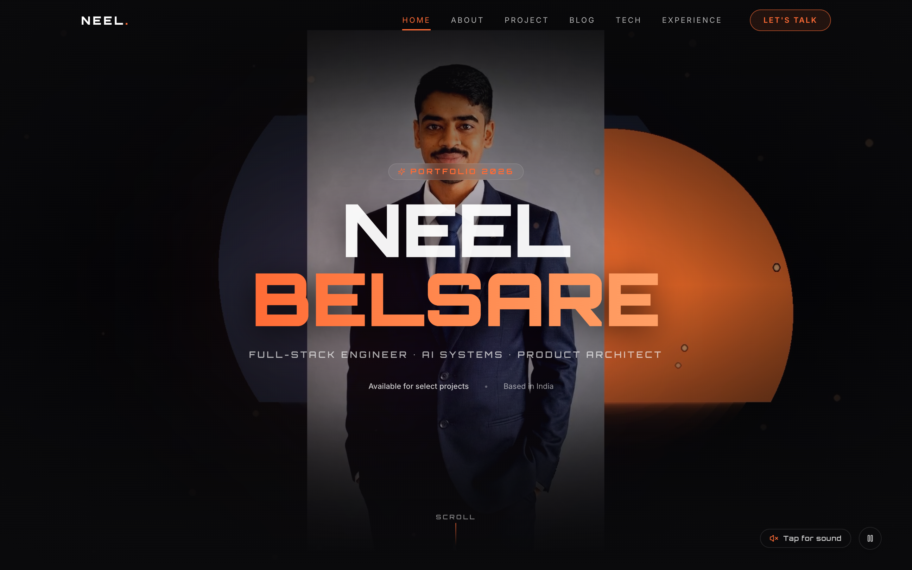
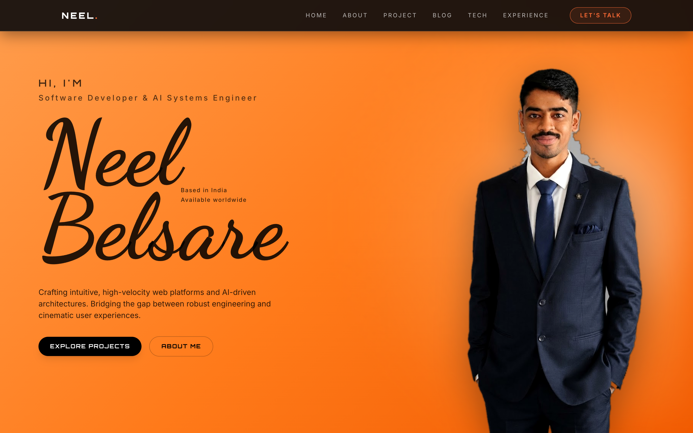
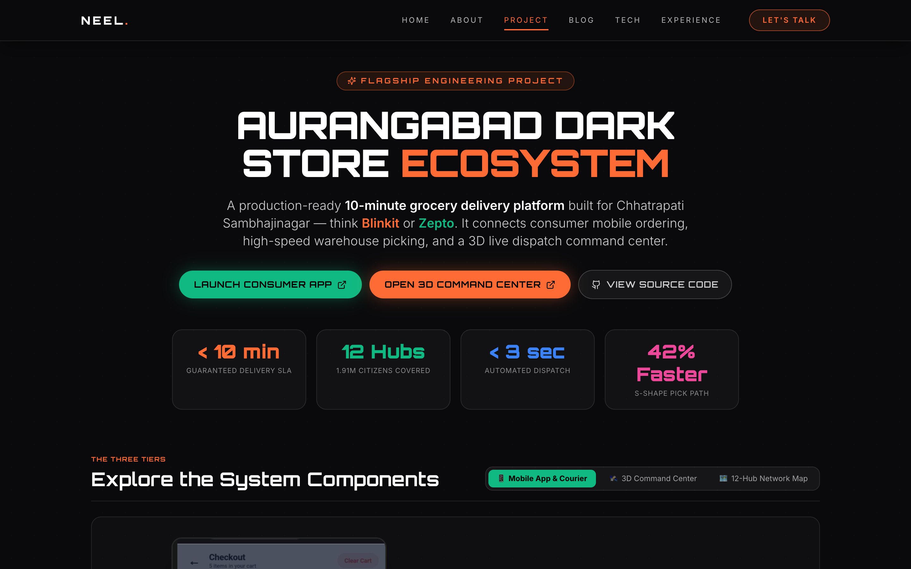
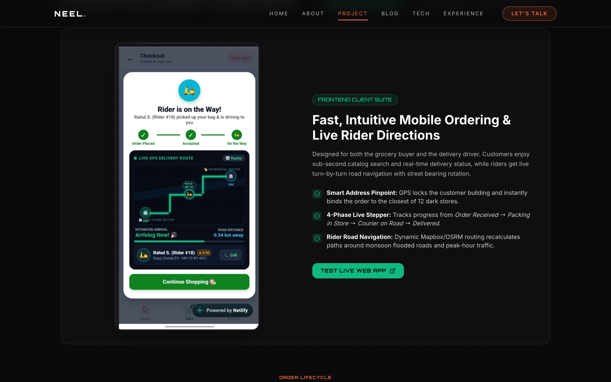
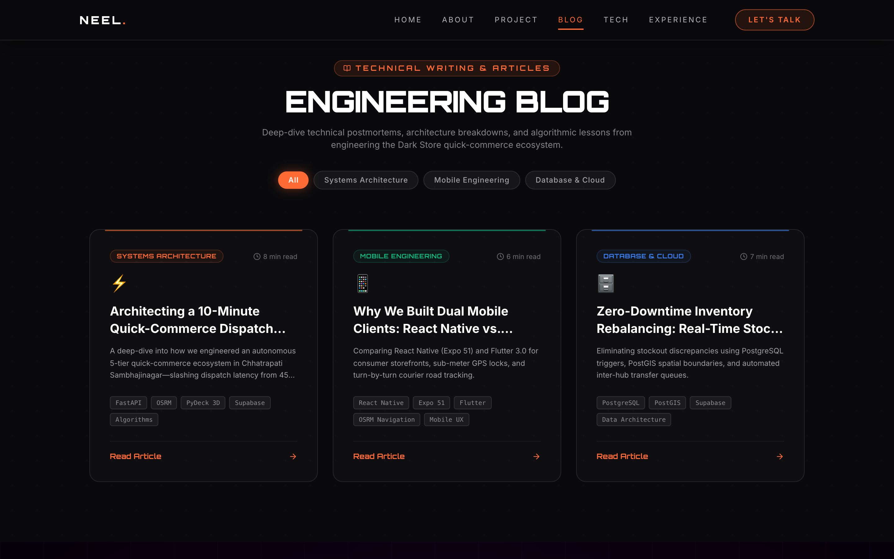
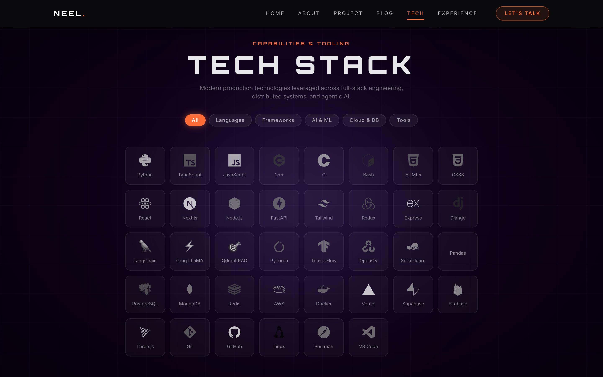

# 🚀 Neel Belsare — Cinematic Engineering Portfolio

[](https://neelbelsare.vercel.app)
[](LICENSE)
[](https://nextjs.org)
[](https://tailwindcss.com)

> **A modern, Awwwards-inspired personal portfolio engineered with Next.js 14, Tailwind CSS, TypeScript, and Framer Motion.**  
> Features an interactive welcome video, dynamic editorial cutout reveals, real-time typing bio, and an in-depth showcase of the flagship **Aurangabad Quick-Commerce Dark Store Ecosystem (v4.0)**.

---

## 📸 Live Site Screenshots

### 1. Cinematic Hero Welcome Screen


---

### 2. Signature Name Reveal & Editorial Profile


---

### 3. Flagship Showcase: Quick-Commerce Dark Store Ecosystem


---

### 4. Dual-Client Mobile App & Live Dispatch Navigation


---

### 5. In-Depth Engineering Blog


---

### 6. Interactive Capabilities & Tooling Matrix


---

## ✨ Core Features

- **🎬 Cinematic Video Intro:** Autoplay ambient video, audio toggle, play/pause controls, and kinetic typography.
- **🎨 Editorial Cutout Reveal:** Signature high-contrast banner with cutout portrait and responsive typography.
- **📦 Flagship Engineering Showcase:** Dedicated presentation of the Aurangabad Quick-Commerce Dark Store Ecosystem with interactive tabs, live Netlify / Streamlit links, and an expandable 5-tier architecture deep-dive.
- **⏱️ 10-Minute Delivery Journey:** Visual order lifecycle flowchart breaking down the 4 steps from customer tap to doorstep drop-off.
- **📝 Technical Engineering Blog:** Interactive engineering postmortems, architecture breakdowns, and algorithmic lessons.
- **🛠️ Tech Stack Matrix:** Categorized grid of languages, frameworks, AI/ML tools, and cloud platforms with filter pills.
- **📱 Fully Responsive:** Optimized for ultra-wide monitors, standard laptops, tablets, and mobile devices.

---

## 🛠️ Tech Stack

- **Framework:** Next.js 14 (App Router, Static Export)
- **Styling:** Tailwind CSS 3.4
- **Animations:** Framer Motion & CSS keyframes
- **Icons:** Lucide React & Devicon
- **Typography:** Orbitron, Dancing Script, Inter
- **Hosting:** Vercel Global Edge Network ([neelbelsare.vercel.app](https://neelbelsare.vercel.app))

---

## 🚀 Local Development

1. **Clone the repository:**
   ```bash
   git clone https://github.com/Neel-Belsare/portfolio.git
   cd portfolio
   ```

2. **Install dependencies:**
   ```bash
   npm install
   ```

3. **Run the development server:**
   ```bash
   npm run dev
   ```

4. **Open in browser:**
   Navigate to [http://localhost:3000](http://localhost:3000).

---

## 📦 Production Build

```bash
# Build static export for Vercel or GitHub Pages
npm run build
```

---

## 📬 Contact & Links

- **Live Website:** [https://neelbelsare.vercel.app](https://neelbelsare.vercel.app)
- **GitHub Profile:** [@Neel-Belsare](https://github.com/Neel-Belsare)
- **Email:** [neelbelsaredpvn@gmail.com](mailto:neelbelsaredpvn@gmail.com)
